# Кольорова гармонія
це система правил, які описують поєднання відтінків, що сприймаються людиною як узгоджені й естетично привабливі

Для дизайну:

* Створює приємний, збалансований вигляд, щоб користувачеві було комфортно.
* Підсилює емоцію бренду й робить інтерфейс упізнаваним.
* Допомагає виділяти акценти та покращує читабельність/UX.
* Полегшує дотримання стандартів доступності (WCAG).
* Економить час: дизайнер швидше підбирає палітри без хаотичних спроб.

Основні типи гармоній:

* Analogous (аналогічна): 3-5 сусідніх відтінків на колірному колесі; м'яка,
  майже безконтрастна палітра - ідеальна для спокійних фонів і wellness‑інтерфейсів.
* Monochromatic (монохроматична): варіації яскравості й насиченості одного відтінку; надає цілісності та мінімалізму, популярна в дашбордах і інфографіці.
* Triad (тріада): три точки, віддалені одна від одної на 120°; живий збалансований контраст, пасує ігровим UI та плакатам.
* Complementary (комплементарна): пара протилежних кольорів; забезпечує максимальний контраст для акцентів, наприклад CTA‑кнопок.
* Split‑Complementary (розділена комплементарна): базовий колір і дві сусідні до його комплемента; виразна, але легше збалансувати, підходить для презентацій і бренд‑ілюстрацій.
* Square (квадратна): чотири точки через 90°; рівно балансує теплі й холодні тони, доречна у великих UI‑системах.
* Custom (власна): довільне розташування будь‑якої кількості точок; дозволяє створити унікальні бренд‑палітри для специфічних задач.

---

### Базовий колір: #842CDB

#### Analogous:
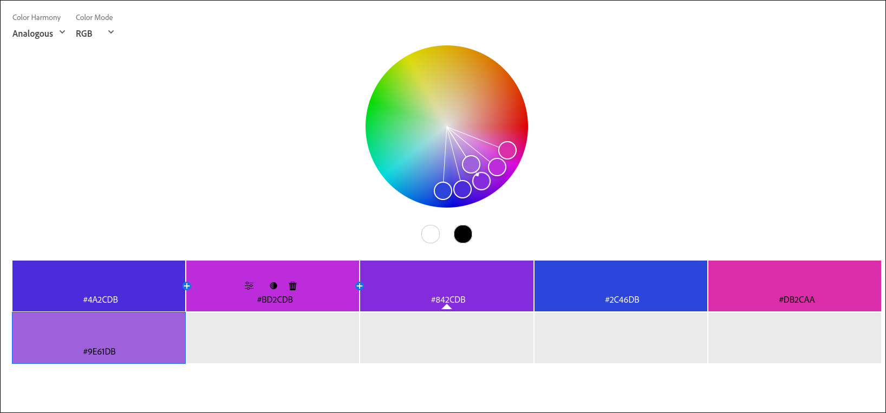
П'ять кольорів розташовані поруч на колірному колесі в межах вузького спектру - від насиченого синього (#2C46DB) до яскраво-фіолетового (#DB2CAA). Палітра виглядає яскраво, але злагоджено, створює відчуття творчості, динаміки й футуризму. Підійде для цифрових продуктів, креативних сервісів або презентацій, де потрібна сучасна візуальна виразність без агресивних контрастів.

#### Monochromatic:

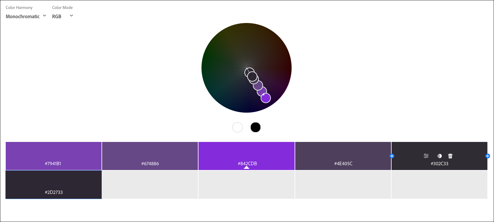

Усі кольори мають однаковий тон (Hue) і належать до одного спектра - фіолетового. Відтінки варіюються лише за яскравістю та насиченістю - від світло-лілового (#7941B1) до майже чорного фіолетового (#302C33). Таку гаму легко збалансувати в інтерфейсі. Монохромна палітра виглядає цілісно, стримано й глибоко. Вона навіює відчуття стабільності, елегантності та інтелектуальної концентрації. Добре працює в контекстах, де важлива атмосфера зосередженості або візуальна єдність - наприклад, у корпоративних сайтах, освітніх платформах або творчих портфоліо.

#### Triad:

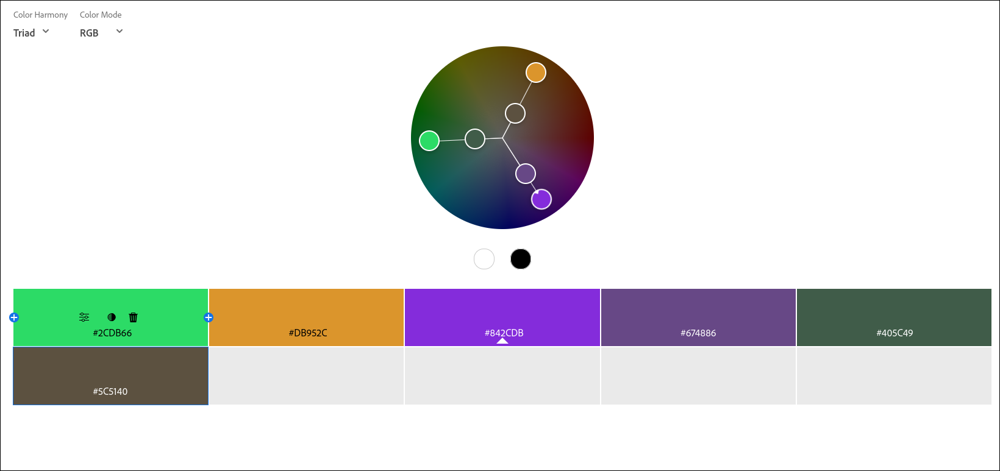

Три основні кольори розташовані на колірному колесі під кутом 120°: яскраво-зелений (#2CDB66), золотисто-оранжевий (#DB952C) та насичений фіолетовий (#842CDB). Додаткові варіації (#674886, #405C49) допомагають пом'якшити контраст і забезпечити підтримку для фонових або нейтральних елементів. Тріадна палітра виглядає контрастно, живо й урівноважено. Вона створює відчуття балансу між енергією (зелений), теплом (помаранчевий) і глибиною (фіолетовий). Підійде для брендів, що прагнуть бути динамічними, відкритими й водночас креативними.

#### Complementary:

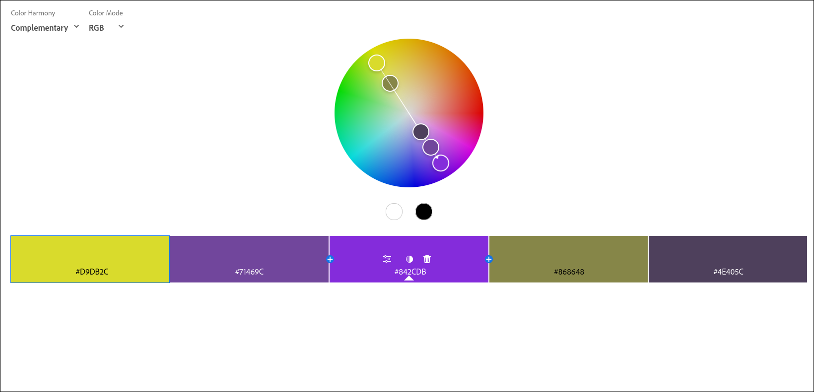

Основна пара - насичений фіолетовий #842CDB і його комплементарний жовто-зелений #D9DB2C. Вони розташовані напроти один одного на колірному колесі, що забезпечує максимальний контраст. Додаткові варіації (#71469C, #868648, #4E405C) пом'якшують переходи й додають палітрі глибини. Ця схема виглядає яскраво й напружено - фіолетовий асоціюється з креативністю, а жовто-зелений - з енергією та свіжістю. Разом вони створюють драматичний, помітний ефект і добре підходять для акцентів у дизайні, де потрібно привернути увагу або зробити яскравий візуальний акцент.

#### Split Complementary:

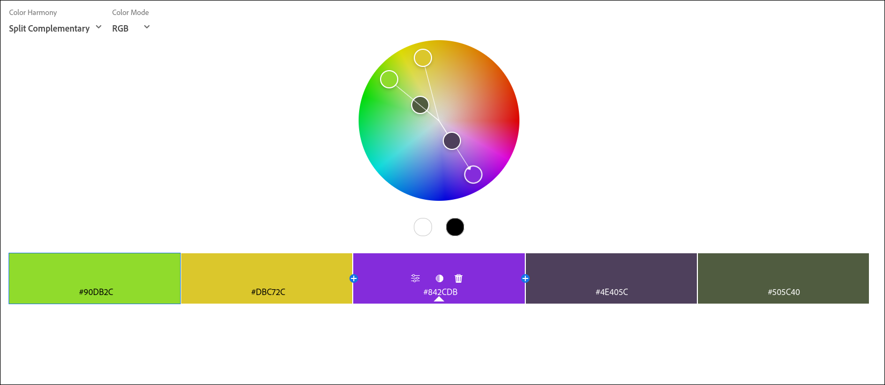

Базовий колір - насичений фіолетовий #842CDB. Замість прямого комплемента використовуються два сусідні до нього кольори: яскраво-зелений #90DB2C та теплий жовтий #DBC72C. Це створює сильний, але менш різкий контраст, ніж класична complementary. Темні тони (#4E405C, #505C40) допомагають урівноважити композицію. Палітра виглядає виразно, але м'якше, ніж контрастні схеми. Вона створює відчуття свіжості, оригінальності та гармонійної енергії. Підходить для інтерфейсів або брендів, які прагнуть вирізнятись, залишаючись в межах візуального комфорту.

#### Square:

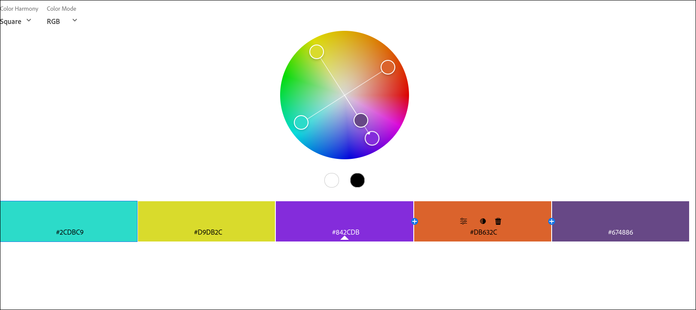

Обрано чотири кольори, рівновіддалені один від одного на 90°: бірюзовий #2CDBC9, жовтий #D9DB2C, фіолетовий #842CDB і помаранчевий #DB632C. Таке розміщення дає гармонійне, але насичене поєднання, де жоден із кольорів не переважає. Додатковий тон #674886 пом'якшує перехід між основними. Палітра виглядає яскраво, контрастно й збалансовано, створюючи відчуття динаміки та енергії. Завдяки різноманіттю температур (теплі й холодні тони) її можна ефективно використовувати для складних інтерфейсів, інфографіки або бренд-дизайну, де важлива візуальна різноманітність без втрати гармонії.

#### Custom:

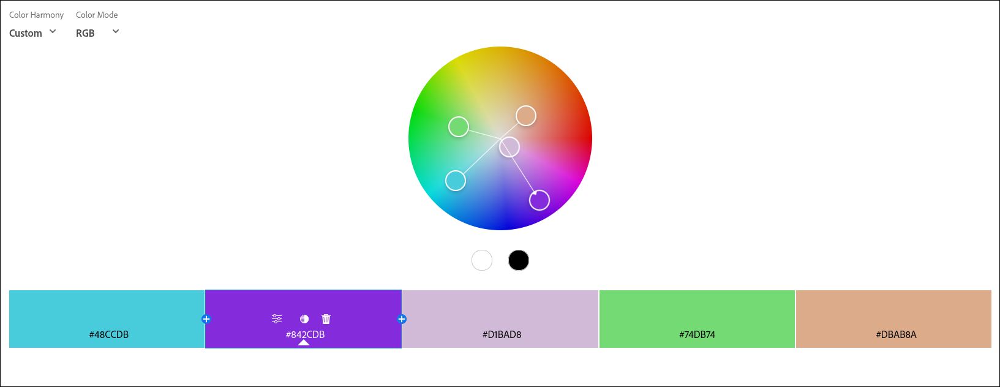

Кольори підібрані індивідуально: холодний бірюзовий (#48CCDB), насичений фіолетовий (#842CDB), ніжно-лавандовий (#D1BAD8), м'який салатовий (#74DB74) та тілесно-пісочний (#DBAB8A). Вони розкидані по всьому колірному колу, але мають узгоджену світлоту і м'яку насиченість, що утримує композицію в гармонії. Характер - сучасний, мрійливий, трохи арт-естетичний. Такий набір добре працює для креативних або lifestyle-проєктів, пов'язаних із модою, освітою, арт- івентами або крафтовими брендами.

---

### Colorful:

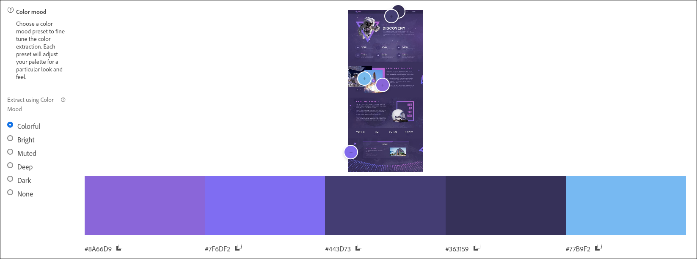

Настрій: футуристичний, енергійний і технологічний, з акцентом на дослідження, космос або інновації.

### Muted:

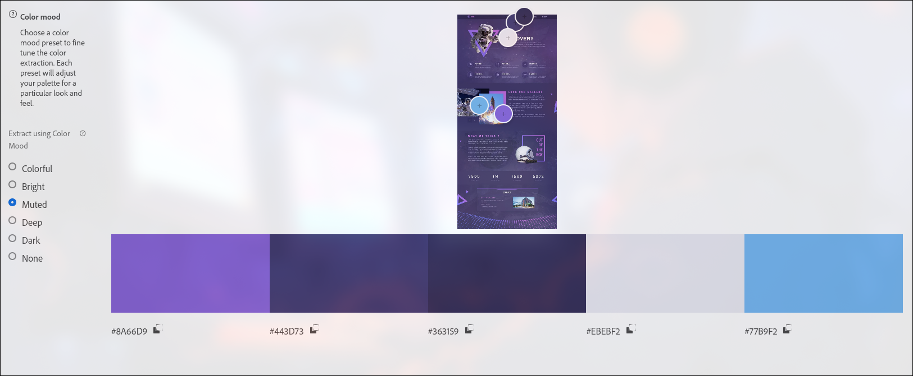

Настрій: спокійний, приглушений і стримано футуристичний. Відтінки виглядають м'яко, створюючи відчуття балансу, глибини та технологічної елегантності.

### Extract Gradient:

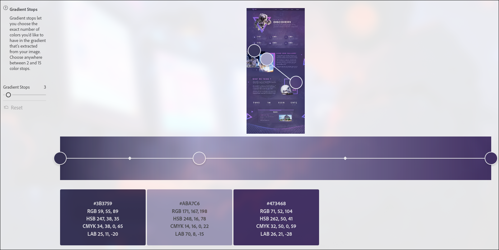

Настрій: спокійний і футуристичний з лавандово-фіолетовими відтінками. Плавний перехід від темного індиго (#3B3759) через ніжний сіро-бузковий (#ABA7C6) до насиченого фіолетового (#473468) створює відчуття глибини, технологічності й витонченості. Такий градієнт чудово пасує для темних UI-дизайнів, освітніх платформ, science-фантастики або арт/космічних тем.

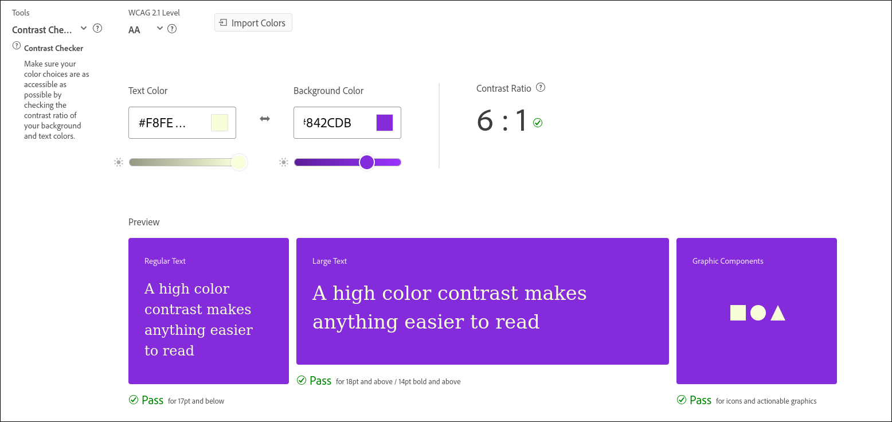
---

### Висновки:

Дослідження підтвердило, що продумане застосування кольору є вирішальним фактором у розробці інтерфейсів, які поєднують привабливий вигляд і зручність користування. Використання різних принципів гармонії, контрастів та засобів кольорового аналізу дозволяє створювати потрібний візуальний ефект і водночас полегшує орієнтацію та сприйняття інформації користувачем.
