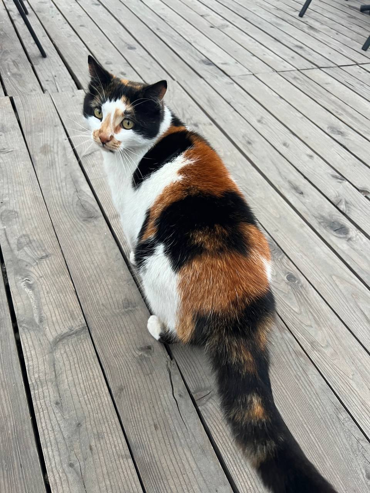
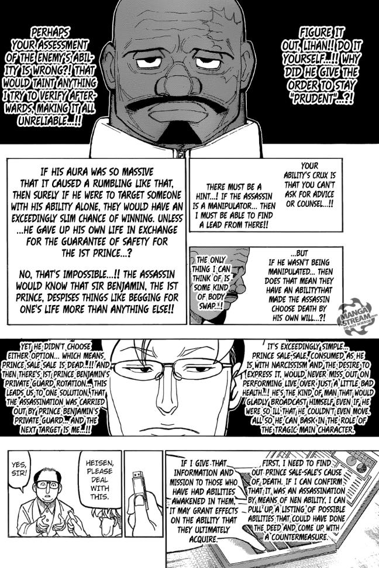

# Звіт: Оптимізація зображень

---
## Опис початкових зображень
|     	Тип зображення     	     | Формат | Розмір файлу |
|:-----------------------------:|:------:|:------------:|
|             Фото              |  JPG   |    212 kB    |
|           Скріншот            |  PNG   |   8.13 MB    |
| Графічне зображення з текстом |  JPG   |    168 kB    |

## Зображення:

*Фото*

*Скріншот*

*Графічне зображення з текстом*

## Порівняння розмірів файлів після різних типів стиснення

### Стиснення без втрати якості (lossless)
|     	Формат     |  Фото  | ️ Скріншот | Графічне зображення з текстом |
|:---------------:|:------:|:----------:|:-----------------------------:|
| PNG (lossless)  | 197 kB |  53.4 kB   |            132 kB             |
| WebP (lossless) | 948 kB |  4.89 MB   |            330 kB             |

### Стиснення з втратою якості (lossy)

#### Формат MozJPEG
|                Якість                |  Фото  | ️ Скріншот | Графічне зображення з текстом |
|:------------------------------------:|:------:|:----------:|:-----------------------------:|
|                 100%                 | 463 kB |  3.46 MB   |            350 kB             |
|                 75%                  | 197 kB |  53.4 kB   |            132 kB             |
|                 50%                  | 113 kB |  37.3 kB   |            92.5 kB            |
| Мінімальний прийнятний рівень якості |  20%   |    55%     |              50%              |

#### Формат WebP (lossy)

|                Якість                |  Фото  | Скріншот | Графічне зображення з текстом |
|:------------------------------------:|:------:|:--------:|:-----------------------------:|
|                 100%                 | 504 kB |  788 kB  |            300 kB             |
|                 75%                  | 160 kB | 34.5 kB  |            144 kB             |
|                 50%                  | 120 kB | 29.2 kB  |            121 kB             |
| Мінімальний прийнятний рівень якості |  20%   |   20%    |              20%              |

#### Формат AVIF

|                Якість                |  Фото  | Скріншот | Графічне зображення з текстом |
|:------------------------------------:|:------:|:--------:|:-----------------------------:|
|                 100%                 | 361 kB | 1.64 MB  |            354 kB             |
|                 75%                  | 199 kB | 22.1 kB  |            179 kB             |
|                 50%                  | 107 kB | 12.2 kB  |            120 kB             |
| Мінімальний прийнятний рівень якості |  35%   |   20%    |              25%              |

## Оптимізація розміру відповідно до цільового використання

|     Розмір     |  Фото   | Скріншот | Графічне зображення з текстом |
|:--------------:|:-------:|:--------:|:-----------------------------:|
| Ширина 1200 px | 302 kB  |  984 kB  |            445 kB             |
| Ширина 600 px  | 96.7 kB |  206 kB  |            164 kB             |
|   2x версія    | 543 kB  | 26.4 MB  |            491 kB             |

## Висновки

1. Який формат найкраще підходить для якого типу зображень:
   - Для фото найкраще підходить формат WebP або AVIF з втратами, оскільки вони дають малий розмір без суттєвої втрати якості.
   - Для скріншотів оптимальним є AVIF (lossy) - він забезпечує мінімальний розмір і чіткість деталей.
   - Для графіки з текстом найкращими є AVIF або MozJPEG, бо добре зберігають контрастність і різкість при помірному розмірі.

2. Як зміна розміру впливає на оптимізацію:
   - Зменшення розміру зображення (1200px -> 600px) значно знижує вагу файлу без помітної втрати якості.
   - 2x-версії для Retina займають значно більше місця, тому варто використовувати компроміс між якістю та розміром.

3. Як правильно адаптувати зображення для Retina-дисплеїв:
   - Використовувати 2x або 3x версії для чіткішого відображення.
   - Використовувати формати з ефективним стисненням, такі як WebP або AVIF.
